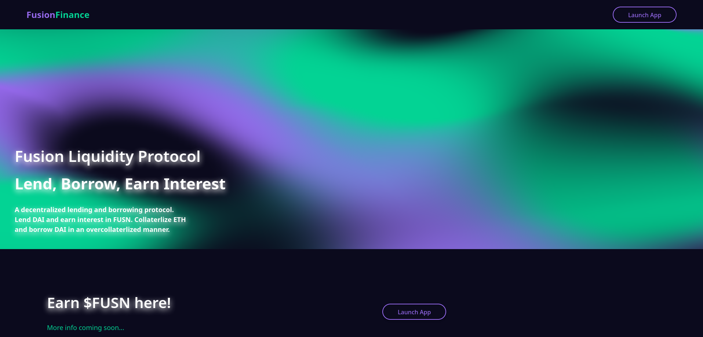
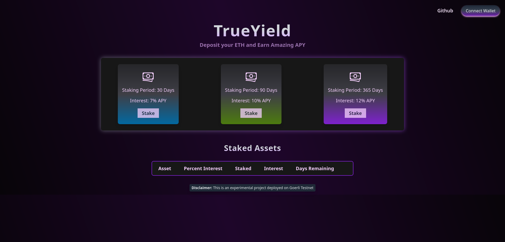
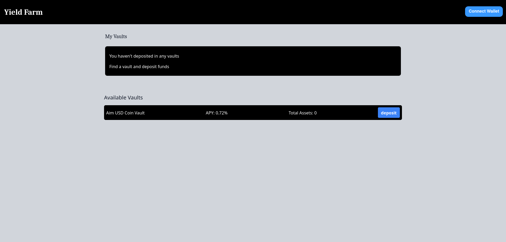

# Hi! this is us.
At Crystalize, we are dedicated to further pushing innovation in Web 3. We operate via research, auditing, recruiting, and training programs to contribute towards the growth of the entire Web 3 ecosystem. You can check us out at https://crystalize.dev/. 

## Crystalize Training Cohorts
A highly selective program made for the new generation of builders. A cohort is 12 weeks long, with extensive training programming intended for Web 2 developers to make them well-equipped in Blockchain principals, Solidity, EVM (Ethereum Virtual Machine) operations,dApp development, common security pitfalls, and auditing techniques. 

During the cohort, participants are provided reading material, excercises, quizes, and assignments from Solidity basics to auditing tools. They have support from mentors duting these weeks to help them with their problems. In the last four weeks, participants work on their capstone project. They go from design doc to deployment including peer audits.

We just completed our first cohort (June 2022 - September 2022), and the results were exciting to say the least! Look at what our amazing participants have made for their capstone project!

### [Fusion Finance](https://fusion-finance.vercel.app/) by John Nyugen

### [True Yield](https://trueyield.netlify.app/) by Umair Mirza

### [Yield Farm](https://yieldcomp.vercel.app/) by Ikechukwu Ahiara

